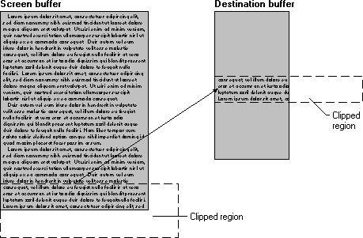

# Low-Level Console Output Functions

The low-level console output functions provide direct access to the character cells of a screen buffer. One set of functions reads from or writes to consecutive cells beginning at any location in the console screen buffer. Another set of functions reads from or writes to rectangular blocks of cells.

The following functions read from or write to a specified number of consecutive character cells in a screen buffer, beginning with a specified cell.

| Function                                                           | Description                                                                                                             |
|--------------------------------------------------------------------|-------------------------------------------------------------------------------------------------------------------------|
| [**ReadConsoleOutputCharacter**](readconsoleoutputcharacter.md)   | Copies a string of Unicode or ANSI characters from a screen buffer.                                                     |
| [**WriteConsoleOutputCharacter**](writeconsoleoutputcharacter.md) | Writes a string of Unicode or ANSI characters to a screen buffer.                                                       |
| [**ReadConsoleOutputAttribute**](readconsoleoutputattribute.md)   | Copies a string of text and background color attributes from a screen buffer.                                           |
| [**WriteConsoleOutputAttribute**](writeconsoleoutputattribute.md) | Writes a string of text and background color attributes to a screen buffer.                                             |
| [**FillConsoleOutputCharacter**](fillconsoleoutputcharacter.md)   | Writes a single Unicode or ANSI character to a specified number of consecutive cells in a screen buffer.                |
| [**FillConsoleOutputAttribute**](fillconsoleoutputattribute.md)   | Writes a text and background color attribute combination to a specified number of consecutive cells in a screen buffer. |
||
||
||
||

 

For all of these functions, when the last cell of a row is encountered, reading or writing wraps around to the first cell of the next row. When the end of the last row of the console screen buffer is encountered, the write functions discard all unwritten characters or attributes, and the read functions report the number of characters or attributes actually written.

The following functions read from or write to rectangular blocks of character cells at a specified location in a screen buffer.

| Function                                         | Description                                                                                                               |
|--------------------------------------------------|---------------------------------------------------------------------------------------------------------------------------|
| [**ReadConsoleOutput**](readconsoleoutput.md)   | Copies character and color data from a specified block of screen buffer cells into a given block in a destination buffer. |
| [**WriteConsoleOutput**](writeconsoleoutput.md) | Writes character and color data to a specified block of screen buffer cells from a given block in a source buffer.        |

 

These functions treat screen buffers and source or destination buffers as two-dimensional arrays of [**CHAR\_INFO**](char-info-str.md) structures (containing character and color attribute data for each cell). The functions specify the width and height, in character cells, of the source or destination buffer, and the pointer to the buffer is treated as a pointer to the origin cell (0,0) of the two-dimensional array. The functions use a [**SMALL\_RECT**](small-rect-str.md) structure to specify which rectangle to access in the console screen buffer, and the coordinates of the upper left cell in the source or destination buffer determine the location of the corresponding rectangle in that buffer.

These functions automatically clip the specified screen buffer rectangle to fit within the boundaries of the console screen buffer. For example, if the rectangle specifies lower right coordinates that are (column 100, row 50) and the console screen buffer is only 80 columns wide, the coordinates are clipped so that they are (column 79, row 50). Similarly, this adjusted rectangle is again clipped to fit within the boundaries of the source or destination buffer. The screen buffer coordinates of the actual rectangle that was read from or written to are specified. For an example that uses these functions, see [Reading and Writing Blocks of Characters and Attributes](reading-and-writing-blocks-of-characters-and-attributes.md).

The illustration shows a [**ReadConsoleOutput**](readconsoleoutput.md) operation where clipping occurs when the block is read from the console screen buffer, and again when the block is copied into the destination buffer. The function reports the actual screen buffer rectangle that it copied from.

 

 

